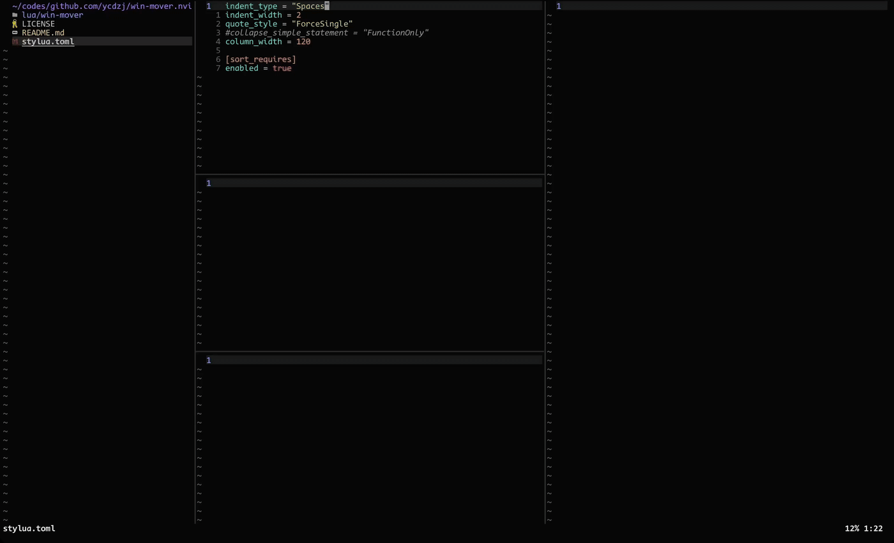

# win-mover.nvim

`win-mover.nvim` is a plugin that helps you move Neovim windows easily.



## Features

- Window Move Mode similar to [WinShift.nvim](https://github.com/sindrets/winshift.nvim)
- Ignore side windows (e.g. NvimTree) so they stay where they are
- Simple implementation

## Requirements

- Neovim >= 0.7.2

## Installation

Install it with your favorite plugin manager:

### lazy

```lua
{
  'ycdzj/win-mover.nvim',
  lazy = false,
  config = function()
    local win_mover = require('win-mover')
    win_mover.setup({}) -- configuration goes here
  end,
}
```

### packer

```lua
use {
  'ycdzj/win-mover.nvim',
  config = function()
    local win_mover = require('win-mover')
    win_mover.setup({}) -- configuration goes here
  end,
}
```

### vim-plug

1. Add this to your config:
    ```vim
    Plug 'ycdzj/win-mover.nvim'
    ```
2. Call `require('win-mover').setup` with your configuration before using this plugin.

## Example Configuration

This is an example that:

- Binds `h,j,k,l` to move window in Window Move Mode, `q` or `<Esc>` to quit.
- Ignores windows such as `NvimTree`, `neo-tree`, etc.

```lua
local win_mover = require('win-mover')
win_mover.setup({
  ignore = {
    enable = true,
    filetypes = { 'NvimTree', 'neo-tree', 'Outline', 'toggleterm' },
  },
  move_mode = {
    keymap = {
      h = win_mover.ops.move_left,
      j = win_mover.ops.move_down,
      k = win_mover.ops.move_up,
      l = win_mover.ops.move_right,

      H = win_mover.ops.move_far_left,
      J = win_mover.ops.move_far_down,
      K = win_mover.ops.move_far_up,
      L = win_mover.ops.move_far_right,

      q = win_mover.ops.quit,
      ['<Esc>'] = win_mover.ops.quit,
    },
  },
})
```

## Commands

- `:WinMover`

    Enter Window Move Mode

## Default Configuration

Below are the defaults. You only need to specify what you want to overwrite in your configuration.

```lua
{
  ignore = {
    enable = false,
    filetypes = {},
  },
  highlight = {
    color = '#2e3440',
    transparency = 60,
  },
  move_mode = {
    keymap = {},
  },
}
```
